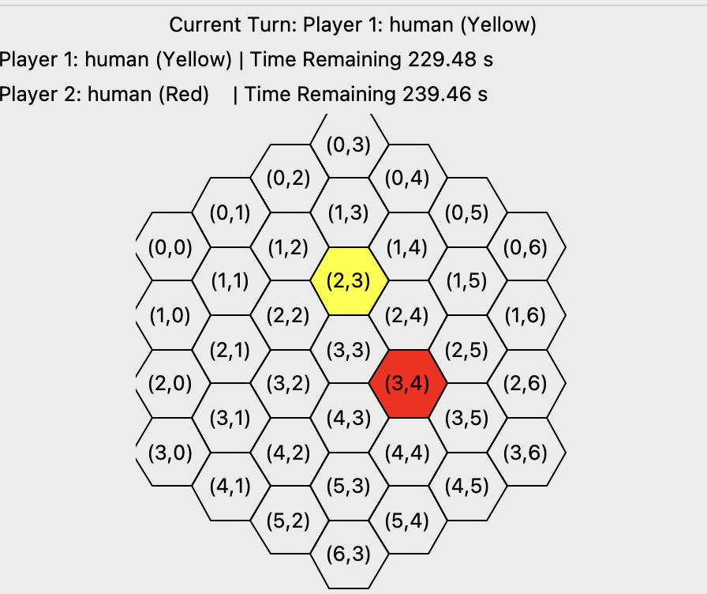

# ♟️ Havannah AI – Game Playing Agent with Minimax & Alpha-Beta Pruning

This project implements a Game Playing AI for the board game Havannah. The AI uses the Minimax algorithm with Alpha–Beta pruning to make intelligent, time-bounded decisions. It supports playing against a human or a random-move opponent, and can detect all Havannah winning conditions — Bridge, Fork, and Ring.

---

## 🎯 Game Rules
Players alternate turns, placing their colored pieces on empty cells of the board.A player wins if they form any one of the following:
- Bridge – A continuous chain connecting any two of the six corners.
- Fork – A chain connecting three different edges (edges do not include corners).
- Ring – A closed loop of pieces enclosing at least one cell (can be empty or occupied).

---

## ✨ Features

- ✅ Minimax Algorithm – Looks ahead to decide the optimal move.
- ✅ Alpha–Beta Pruning – Reduces computation time.
- ✅ Customizable Board Size – Easily switch between board configurations.
- ✅ Multiple Player Modes – Human vs AI, AI vs Random.
- ✅ SVG Board Rendering – Clear visual representation of the board and moves.
- ✅ Winning Condition Detection – Automatic recognition of Bridge, Fork, and Ring.

---
